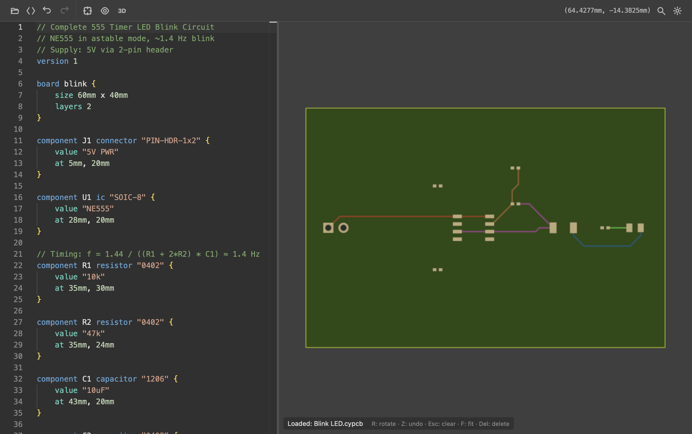
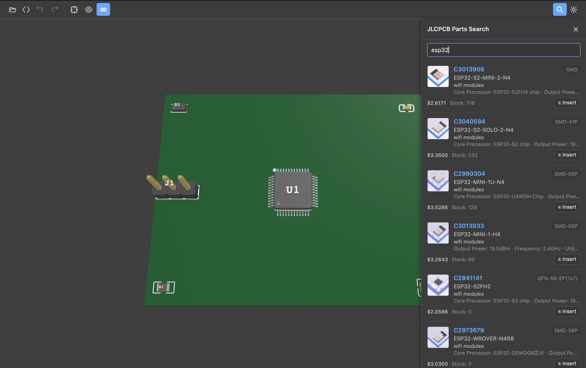
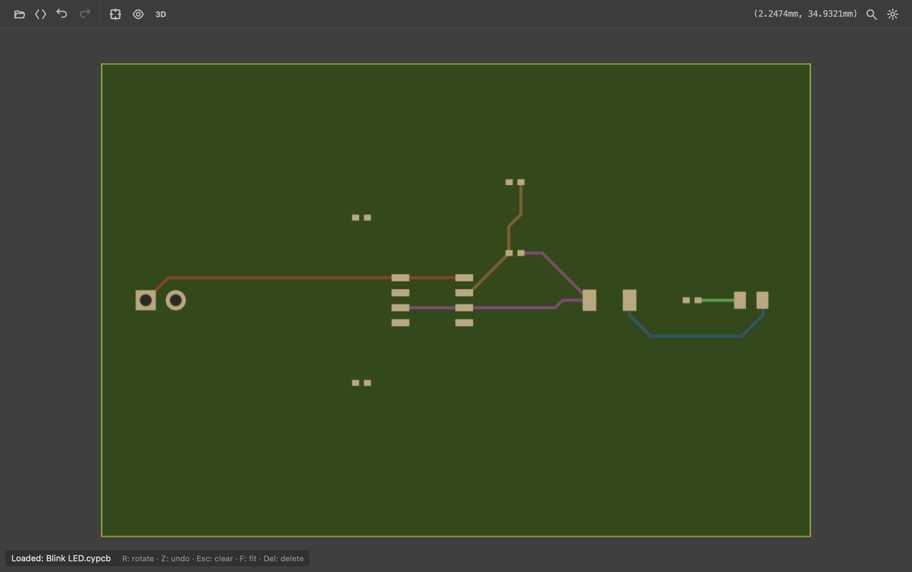
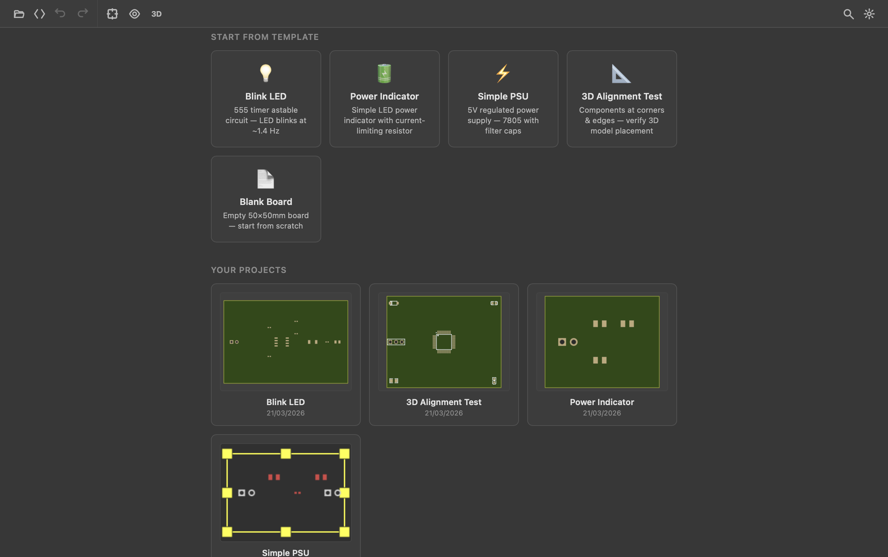

# CodeYourPCB

**Code-first PCB design.** Describe your circuit board in a simple DSL — get a deterministic, git-friendly, AI-editable design.

```cypcb
// blink.cypcb — 555 timer LED blink circuit
version 1

board blink {
    size 60mm x 40mm
    layers 2
}

component J1 connector "PIN-HDR-1x2" { value "5V PWR"; at 5mm, 20mm }
component U1 ic "SOIC-8" { value "NE555"; at 28mm, 20mm }
component R1 resistor "0402" { value "10k"; at 35mm, 30mm }
component C1 capacitor "1206" { value "10uF"; at 43mm, 20mm }
component LED1 led "0805" { value "RED"; at 55mm, 20mm }

net VCC [width 0.5mm  current 2A] { J1.1; U1.8; U1.4; R1.1 }
net GND { J1.2; U1.1; C1.2; LED1.K }

// Routed traces saved in the file — survives reload, diffs cleanly
trace VCC {
    layer Top
    width 0.5mm
    path 5mm,20mm -> 15mm,20mm -> 28mm,20mm -> 35mm,30mm
}
```

<p align="center">
  
</p>

Save the file, board updates instantly. No compile step, no refresh.

**New here?** [Syntax reference](docs/SYNTAX.md) | [Getting started](docs/user-guide/getting-started.md) | [Examples](examples/)

---

## Why?

Traditional PCB tools (KiCad, Altium, Eagle) are GUI-first. The project file is a binary/XML side-effect of clicking. This makes:

- **Git diffs** unreadable
- **AI assistance** impractical
- **Team review** painful
- **Automation** fragile

CodeYourPCB flips the model: the source file _is_ the design. Text in, board out.

## The LLM angle

The core idea: give AI coding assistants like Claude Code, Copilot, or Cursor the ability to **design real PCBs through declarative code** — the same way they write software.

Traditional PCB formats are opaque to LLMs. A KiCad `.kicad_pcb` file is thousands of lines of coordinate soup. No LLM can reason about that meaningfully.

`.cypcb` is different — the semantics are declarative and human-readable:

```cypcb
component U1 ic "SOIC-8" { value "NE555"; at 28mm, 20mm }
net VCC [width 0.5mm  current 2A] { U1.8; U1.4; R1.1 }

trace VCC {
    layer Top
    width 0.5mm
    path 5mm,20mm -> 28mm,20mm -> 35mm,30mm
}
```

An LLM can generate this, review it, refactor it, and catch mistakes — just like source code. Even routed traces are human-readable `path` blocks that diff cleanly in git.

<p align="center">
  
</p>

---

## Features

| Feature | Status |
|---------|--------|
| `.cypcb` DSL with Tree-sitter parser | Done |
| Live preview — save file, board updates instantly | Done |
| 2D renderer (KiCad-style) | Done |
| 3D viewer — extruded copper, solder mask, round trace caps | Done |
| Interactive trace routing (45° constraint, obstacle dodge) | Done |
| Trace segment & corner editing (drag to reshape) | Done |
| Trace persistence — routed traces saved as `path` blocks, survive reload | Done |
| Bidirectional sync — edit trace code ↔ board updates in real-time | Done |
| Net constraints — `[width 0.5mm]`, `[current 2A]` per net | Done |
| IPC-2221 auto-width from current rating | Done |
| DRC — clearance, drill, connectivity, trace width, hole-to-hole, solder mask, annular ring, edge, courtyard, zone overlap, pour island | Done — sixteen rules; `cypcb check` prints copper-on-copper apart from a gap under spec, and gives an orphaned plane its size and corners |
| DRC — silkscreen clearance | Done — a Rust rule checks a footprint's own artwork against every other part's pads on the same side |
| Gerber / Excellon / BOM / pick-and-place export | Done |
| Monaco editor with context-aware completions | Done |
| JLCPCB parts search & placement | Done |
| Custom footprint definitions in DSL | Done |
| Project manager with templates | Done |
| Dark / Light theme | Done |
| Web app (WASM) | Done |
| Desktop app (Tauri v2) | Builds on macOS and Windows; the Linux build needs GTK/webkit dev packages and is excluded from CI |
| Autorouter — PathFinder negotiated congestion, multi-layer | Routes the benchmark boards complete; **the toolbar button is hidden** while routing quality is worked on |
| KiCad component library import | Done |
| KiCad `.kicad_pcb` import | Done — `cypcb parse-kicad`, used by the routing benchmarks |
| KiCad `.kicad_pcb` export | Planned |
| Copper pour / ground planes | Done — a zone is filled against the copper on its layer, with the fab's clearance to foreign copper and thermal spokes to its own pads. The same geometry reaches the Gerbers, the viewer and the checker, which reports two planes shorted together and copper the fill left connected to nothing. See `examples/pour-island.cypcb` |
| Module system — reusable circuit blocks | Done — `module` defines one, `use M as N at 10mm, 5mm` places it, modules nest. See `examples/v2-modules.cypcb` |
| `import` — block libraries across files | Done — resolved relative to the importing file; modules, footprints and interfaces cross, a design's own board and parts do not. See `examples/v2-imports.cypcb` |
| `assert` — the design's own claims, checked | Done — `board.*`, `<part>.value` and `<net>.current/width/clearance`; anything else is reported as not checked rather than skipped |
| Parts engine — auto component picking from JLCPCB/LCSC | Planned |
| Schematic generation from `.cypcb` | Planned |
| Differential pair routing | Planned |
| CI/CD in GitHub Actions | Not planned — the quality gate is `scripts/quality-gate.sh`, run locally |

Routing quality on the bundled KiCad benchmarks, measured with
`cargo test --release -p cypcb-autoroute -- benchmark_all_fixtures_drc --ignored`:

| Board | Connections | Violations before routing | After | Introduced by the router |
|---|---|---|---|---|
| led_blink | all routed | 0 | 2 | 2 |
| stm32_breakout | all routed | 12 | 271 | 259 |
| multi_ic | all routed | 60 | 210 | 150 |

Every board routes to completion. The numbers are higher than they were, and
the board is not worse: the checker stopped merging several faults into one
report, started measuring copper instead of part bodies, and began seeing
footprints on imported boards at all. `docs/TRACKER.md` records each change
with what it moved.

`cypcb route --variants` routes several ways and keeps the best, because no
one setting wins everywhere - measured across these three boards, the winner
differs on each. It is 10x the wall clock of a single run and worth it on
led_blink, where the chosen variant reaches zero.

<p align="center">
  
</p>
<p align="center">
  
</p>

---

## Quick Start

### Web (development)

```bash
# Prerequisites: Rust, Node.js 18+, wasm-pack
cargo install wasm-pack

# Clone and start
git clone https://github.com/szymontex/codeyourpcb.git
cd codeyourpcb/viewer
npm install
npm start          # builds WASM + starts dev server
```

Open http://localhost:5173 — pick a template or open a `.cypcb` file.

### Desktop app (Tauri)

```bash
# Linux prerequisites
sudo apt install libwebkit2gtk-4.1-dev libgtk-3-dev libayatana-appindicator3-dev librsvg2-dev pkg-config

npm run dev:desktop   # dev mode
npm run build:desktop # release installer
```

### CLI

```bash
cargo run -p cypcb-cli -- check examples/blink.cypcb          # DRC, exit 1 on violations
cargo run -p cypcb-cli -- export examples/blink.cypcb -o out    # refuses a shorted board unless --force
cargo run -p cypcb-cli -- route examples/blink.cypcb --variants   # route, keep the best
cargo run -p cypcb-cli -- score examples/blink.routed.cypcb   # quality metrics as JSON
cargo run -p cypcb-cli -- export examples/blink.cypcb         # 13 manufacturing files
cargo run -p cypcb-cli -- parse examples/blink.cypcb          # the AST
cargo run -p cypcb-cli -- parse-kicad board.kicad_pcb         # a KiCad board's metadata
```

`check`, `route`, `score` and `export` all take `--preset` (jlcpcb, pcbway,
oshpark and the rest - an unknown name prints the list). They use the same
rules and agree on the same board: a file that `check --preset pcbway` calls
28 violations is 28 to `score --preset pcbway` too.

### IDE workflow

Edit `.cypcb` files in your editor (VS Code, Neovim, etc.). Run `npm run dev:watch` in a terminal — the board preview updates on every save via WebSocket hot reload.

---

## Keyboard Shortcuts

| Key | Action |
|-----|--------|
| `Ctrl+E` | Toggle code editor |
| `Ctrl+S` | Save file |
| `Ctrl+O` | Open file / project manager |
| `Ctrl+J` | JLCPCB parts search |
| `Ctrl+Z` / `Ctrl+Shift+Z` | Undo / Redo |
| `F` | Fit board to view |
| `3` | Toggle 3D view |
| `R` / `Shift+R` | Rotate component CW / CCW |
| `?` | Keyboard shortcuts help |

During trace routing: `F` flip layer, `/` flip posture, `Q` toggle corner mode, `A` toggle angle snap.

---

## Project Structure

```
codeyourpcb/
├── crates/
│   ├── cypcb-core         # Types, coordinates, units
│   ├── cypcb-parser       # Tree-sitter grammar + AST
│   ├── cypcb-world        # ECS board state (hecs)
│   ├── cypcb-drc          # Design rule checks
│   ├── cypcb-autoroute    # A*-based autorouter (WIP)
│   ├── cypcb-router       # FreeRouting DSN bridge
│   ├── cypcb-calc         # Electrical calculations (IPC-2221)
│   ├── cypcb-export       # Gerber / Excellon / CPL export
│   ├── cypcb-kicad        # KiCad format import
│   ├── cypcb-library      # Component library (SQLite + FTS5)
│   ├── cypcb-lsp          # Language server (tower-lsp)
│   ├── cypcb-render       # Board engine (WASM)
│   ├── cypcb-rules        # Design rules & manufacturer presets
│   ├── cypcb-platform     # Native/web abstraction layer
│   ├── cypcb-watcher      # File system watcher
│   └── cypcb-cli          # CLI entry point
├── viewer/                # TypeScript frontend (Vite + Canvas 2D + Three.js)
├── src-tauri/             # Tauri v2 desktop shell
├── examples/              # Sample .cypcb files
└── docs/                  # User guide, syntax, API reference
```

---

## Landscape

CodeYourPCB sits in the emerging "PCB as code" space alongside a few other tools:

- **[JITX](https://www.jitx.com/)** — commercial, most mature code-first EDA. Constraint-driven routing, signal integrity, VS Code integration. Proprietary.
- **[atopile](https://atopile.io/)** — open-source `.ato` language with compiler, reusable modules, component picking. Uses KiCad for layout. MIT.
- **[tscircuit](https://tscircuit.com/)** — open-source React/TypeScript PCB framework. Very LLM-friendly (TypeScript is natural for models). MIT.

Where CodeYourPCB differs: own rendering engine (no KiCad dependency), runs in browser via WASM, interactive routing built-in, traces persist as readable DSL code. Where it's behind: no schematic capture, smaller component library.

---

## Documentation

- [Getting Started](docs/user-guide/getting-started.md)
- [Language Syntax](docs/SYNTAX.md)
- [Architecture](docs/architecture.md)
- [Routing](docs/routing.md) - what the autorouter does, the two settings that pay, and the nine measured and dropped
- [Project Structure](docs/user-guide/project-structure.md)
- [Library Management](docs/user-guide/library-management.md)
- [Platform Differences (Web vs Desktop)](docs/user-guide/platform-differences.md)
- [LSP Server](docs/api/lsp-server.md)
- [Contributing](CONTRIBUTING.md)

---

## Status

Experimental. The DSL and file format may change between versions.

The core loop works: write `.cypcb` → see board → route traces → save → reload
→ export. Traces are deterministic and a saved board reads back as the board
it was, which is checked end to end: routed copper reaches the Gerbers, the
cut path matches the outline the source declares, the mask opens over every
pad and the pick-and-place names the side each part is assembled on.

A copper pour is filled by the engine and drawn from it: the viewer sends the
zones it parsed and gets back the rectangles a fabricator receives, so the
screen cannot disagree with the Gerber. Keepouts are outlined, and copper a
pour left stranded is outlined too, because an island looks exactly like the
rest of the plane.

The main gaps are the autorouter's toolbar button, hidden while routing quality
is worked on, and `interface`, which parses and does nothing.

PRs welcome.

---

## License

Licensed under either of:

- [MIT License](LICENSE-MIT)
- [Apache License, Version 2.0](LICENSE-APACHE)

at your option.
